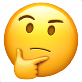
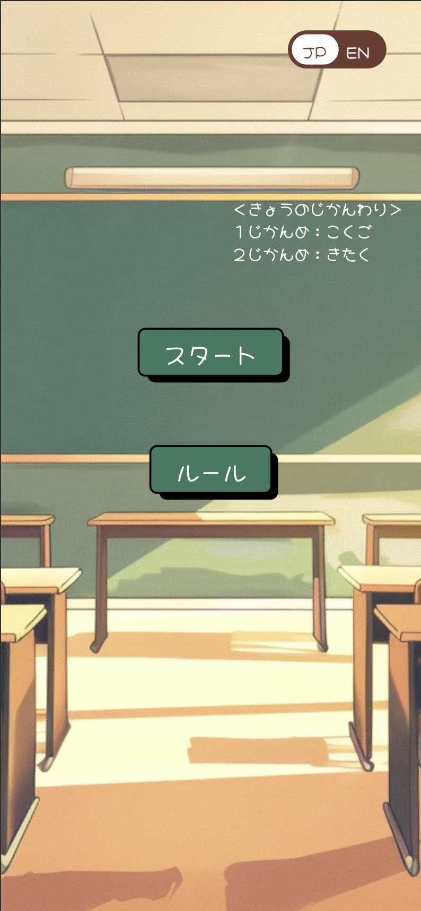
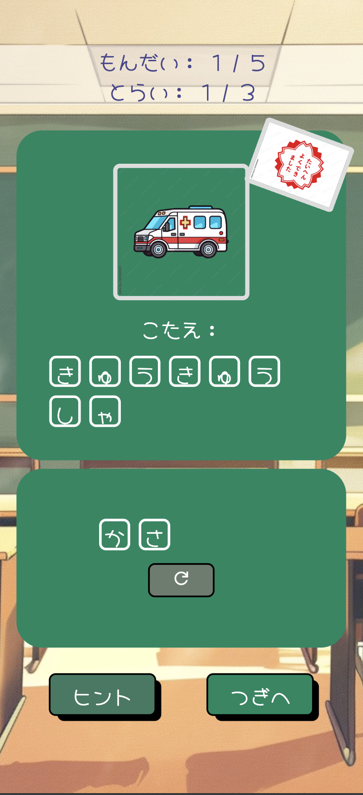
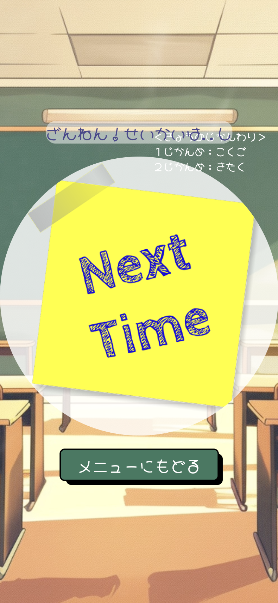
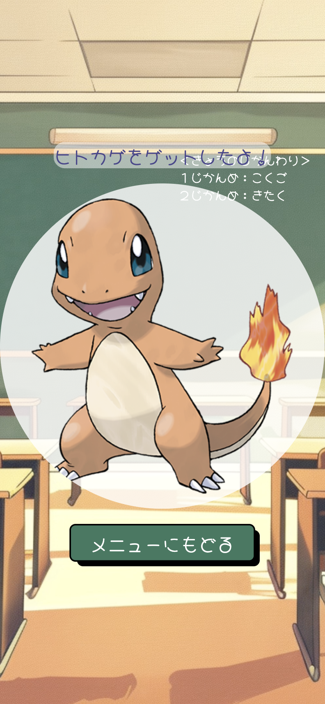

#  Guess the Word Game (Japanese Language Ver.) 

## Introduction
This is a simple front-end word guessing game designed primarily for children at a preschool level or for anyone just beginning to learn the Japanese language. The game aims to provide a fun and casual way to get familiar with Japanese vocabulary, particularly for young learners. (Get all five questions correct and you will win a pokemon..!)

The inspiration behind creating this game came from my desire to help my son — who is primarily educated in English — gain exposure to the Japanese language in an engaging and playful manner.

 [Click Here To Play!]

[Click Here To Play!]: https://yuukka.github.io/guess-the-word-game/

## Screenshots

### Introduction Page

### Game Page

### Try-Next-Time Page

### Win Page

### Mobile View
   

## Tech Stack & Resources
**Frontend:** 
* **HTML**
* **CSS** 
* **JavaScript** 

**Image Resources:** 
* **[Kaggle]**
* **[Adobe Stock]**
* **[Figma]**
* **[Google Fonts]**

**Other Resources:** 
* **w3schools**
* **mdn**
* **stackoverflow**
* **AI Assistance** - Used Generative AI (ChatGPT) to understand and implement drag-and-drop functionality using JavaScript

[Kaggle]:https://www.kaggle.com/datasets/arenagrenade/the-complete-pokemon-images-data-set?resource=download

[Adobe Stock]: https://stock.adobe.com/jp/video

[Figma]: https://www.figma.com/community/file/937774188065101204

[Google Fonts]: https://fonts.google.com

## Future Enhancements
* Expend the question library to add more vocablary
* Add difficulty levels to support differenct level of learners (e.g. Beginner, Intermediate, Advance)
* Implement Touch Event Listeners for Mobile Device Support

